# Arquitetura e Otimizacao do Banco de Dados

Data da analise: 2026-04-12
Escopo analisado: banco local em execucao (`backend/rpg_arena.db`, SQLite)
Objetivo: documentar tabelas, relacionamentos, indices atuais e propor melhorias para reduzir custo de listagens (grimorio, pericias, equipamentos e afins).

## 1) Visao Geral

Total de tabelas de dominio encontradas: 24

- armaduras_protecao
- armaduras_protecao_jogador
- ataques
- combatente_condicoes
- combatentes
- combates
- combates_historico
- condicoes
- equipamentos
- equipamentos_jogador
- grimorio_historico_troca
- grimorio_magias
- grimorio_notificacoes
- magia_historico
- magias
- magias_classes
- magias_preparadas
- magias_slots
- pericia_jogadores
- pericias
- pericias_classes
- talentos
- talentos_jogador
- usuarios

## 2) Desenho de Arquitetura (ER)

```mermaid
erDiagram
    USUARIOS ||--o{ COMBATENTES : possui

    COMBATENTES ||--o{ ATAQUES : tem
    COMBATENTES ||--o{ COMBATENTE_CONDICOES : recebe
    CONDICOES ||--o{ COMBATENTE_CONDICOES : referencia

    COMBATENTES ||--o{ GRIMORIO_MAGIAS : possui
    MAGIAS ||--o{ GRIMORIO_MAGIAS : referencia

    COMBATENTES ||--o{ GRIMORIO_HISTORICO_TROCA : gera
    MAGIAS ||--o{ GRIMORIO_HISTORICO_TROCA : adicionada_removida

    COMBATENTES ||--o{ GRIMORIO_NOTIFICACOES : recebe

    MAGIAS ||--o{ MAGIAS_CLASSES : mapeia

    COMBATENTES ||--o{ MAGIAS_PREPARADAS : prepara
    MAGIAS ||--o{ MAGIAS_PREPARADAS : referencia

    COMBATENTES ||--o{ MAGIAS_SLOTS : possui

    PERICIAS ||--o{ PERICIAS_CLASSES : mapeia
    COMBATENTES ||--o{ PERICIA_JOGADORES : possui
    PERICIAS ||--o{ PERICIA_JOGADORES : referencia

    COMBATENTES ||--o{ EQUIPAMENTOS_JOGADOR : possui
    EQUIPAMENTOS ||--o{ EQUIPAMENTOS_JOGADOR : referencia

    COMBATENTES ||--o{ TALENTOS_JOGADOR : possui
    TALENTOS ||--o{ TALENTOS_JOGADOR : referencia

    COMBATENTES ||--o{ ARMADURAS_PROTECAO_JOGADOR : usa
    ARMADURAS_PROTECAO ||--o{ ARMADURAS_PROTECAO_JOGADOR : referencia

    COMBATES ||--o{ COMBATES_HISTORICO : historico
    MAGIAS ||--o{ MAGIA_HISTORICO : historico
```



## 3) Relacionamentos e Integridade

Principais FKs validadas no banco local:

- `ataques.combatente_id -> combatentes.id` (CASCADE)
- `combatente_condicoes.combatente_id -> combatentes.id` (CASCADE)
- `combatente_condicoes.condicao_id -> condicoes.id` (CASCADE)
- `grimorio_magias.combatente_id -> combatentes.id` (CASCADE)
- `grimorio_magias.magia_id -> magias.id` (CASCADE)
- `magias_preparadas.combatente_id -> combatentes.id` (CASCADE)
- `magias_preparadas.magia_id -> magias.id` (CASCADE)
- `magias_slots.combatente_id -> combatentes.id` (CASCADE)
- `pericia_jogadores.combatente_id -> combatentes.id` (NO ACTION)
- `pericia_jogadores.pericia_id -> pericias.id` (NO ACTION)
- `pericias_classes.pericia_id -> pericias.id` (CASCADE)
- `equipamentos_jogador.combatente_id -> combatentes.id` (CASCADE)
- `equipamentos_jogador.equipamento_id -> equipamentos.id` (CASCADE)
- `talentos_jogador.combatente_id -> combatentes.id` (CASCADE)
- `talentos_jogador.talento_id -> talentos.id` (CASCADE)

### Alertas de integridade

1. `pericia_jogadores` usa `NO ACTION` para FKs
- Risco: sob exclusao/limpeza de combatente ou pericia, pode haver falha transacional ou necessidade de limpeza manual.
- Sugestao: avaliar migrar para `ON DELETE CASCADE` se o comportamento funcional esperado for remover vinculos automaticamente.

2. `magias_slots` sem unicidade por (`combatente_id`, `nivel`)
- Risco: duplicidade de slots do mesmo nivel para o mesmo combatente.
- Sugestao: criar `UNIQUE (combatente_id, nivel)`.

## 4) Analise de Indices (estado atual)

### Bons pontos

- Indices de lookup basico por PK/FK em boa parte das tabelas de associacao.
- Indice unico em `grimorio_magias (combatente_id, magia_id, classe)` evitando duplicidade de grimorio.
- Indice em `magias.nivel` e `magias.nome`.
- Indices de soft-delete/ativo em catalogos (`equipamentos`, `talentos`).

### Gargalos observados via EXPLAIN QUERY PLAN

1. `pericias` por classe
- Consulta por `pericias_classes.classe_nome` faz `SCAN pc` (full scan).
- Falta indice por classe nesta tabela.

2. `magias_slots` por combatente ordenando nivel
- Faz `SCAN magias_slots` + `TEMP B-TREE` para ordenacao.
- Falta indice composto (`combatente_id`, `nivel`).

3. `magias_preparadas` por combatente ordenando por slot
- Usa indice por (`combatente_id`, `magia_id`) mas ordena por `nivel_slot`, gerando custo extra.
- Falta indice composto cobrindo ordenacao por slot.

4. Catalogos ativos (`equipamentos`, `talentos`) ordenados por nome
- Usa indice em `ativo`, mas ainda cria `TEMP B-TREE` para `ORDER BY nome`.
- Indice composto pode reduzir custo.

5. Filtro textual de classe em `magias.classe`
- Consulta via `LIKE '%classe%'` nao usa indice de forma eficiente.
- Tabela `magias_classes` existe para normalizacao, mas esta sem dados no banco local.

## 5) Recomendacoes de Otimizacao

## 5.1 Indices recomendados (prioridade alta)

```sql
-- Pericias por classe
CREATE INDEX IF NOT EXISTS ix_pericias_classes_classe_nome_pericia
ON pericias_classes (classe_nome, pericia_id);

-- Slots por combatente e nivel
CREATE UNIQUE INDEX IF NOT EXISTS uq_magias_slots_combatente_nivel
ON magias_slots (combatente_id, nivel);

-- Preparadas por combatente com ordenacao por slot
CREATE INDEX IF NOT EXISTS ix_magias_preparadas_combatente_slot_magia
ON magias_preparadas (combatente_id, nivel_slot, magia_id);

-- Grimorio por combatente/classe (com ordenacao temporal)
CREATE INDEX IF NOT EXISTS ix_grimorio_magias_combatente_classe_adicionada
ON grimorio_magias (combatente_id, classe, adicionada_em DESC);
```

## 5.2 Indices recomendados (prioridade media)

```sql
-- Catalogo de equipamentos ativo/nao deletado ordenado por nome
CREATE INDEX IF NOT EXISTS ix_equipamentos_ativo_deleted_nome
ON equipamentos (ativo, deleted_at, nome);

-- Catalogo de talentos ativo/nao deletado ordenado por nome
CREATE INDEX IF NOT EXISTS ix_talentos_ativo_deleted_nome
ON talentos (ativo, deleted_at, nome);

-- Filtro operacional de combatentes em listagens
CREATE INDEX IF NOT EXISTS ix_combatentes_tipo_deleted_dono
ON combatentes (tipo, deleted_at, dono_id);
```

## 5.3 Ajuste estrutural para magias por classe (prioridade alta)

Problema atual:
- `magias.classe` armazena texto agregando classes, o que exige `LIKE` e custa mais.
- `magias_classes` esta vazia no banco local analisado.

Recomendacao:
1. Popular `magias_classes` a partir de `magias` (backfill idempotente).
2. Migrar consultas do grimorio para JOIN com `magias_classes` por igualdade (`mc.classe = :classe`).
3. Criar/ajustar indice composto:

```sql
CREATE INDEX IF NOT EXISTS ix_magias_classes_classe_nivel_magia
ON magias_classes (classe, nivel, magia_id);
```

Com isso, a tela do grimorio pode trazer somente as magias da classe do personagem sem varreduras textuais amplas.

## 5.4 Campos e payload (reduzir transferencia)

Para UX mais rapida, nas listagens retornar apenas colunas necessarias no contexto:

- Grimorio lista:
  - `id`, `nome`, `nivel`, `escola`, `classe` (ou classe da relacao), `pagina_referencia`.
  - Evitar `descricao` longa na listagem; carregar detalhes sob demanda.

- Pericias lista:
  - `id`, `nome`, `classe_nome` (quando necessario), custos calculados.

- Equipamentos/Talentos lista:
  - `id`, `nome`, `pagina_referencia`, flags de uso.
  - `descricao` sob demanda.

## 6) Checklist de rollout seguro

1. Criar indices novos em migration incremental.
2. Validar planos com `EXPLAIN` antes/depois.
3. Medir latencia de endpoints de listagem (p95) antes/depois.
4. Fazer backfill de `magias_classes` com script idempotente.
5. Ajustar consultas backend para usar JOIN por classe em vez de `LIKE` textual.

## 7) Risco residual

- Esta analise foi feita no banco local SQLite (estado real local), nao no PostgreSQL de producao.
- Para consolidar tuning de producao, repetir os mesmos passos no PostgreSQL real com estatisticas reais de volume (ANALYZE/EXPLAIN ANALYZE).
