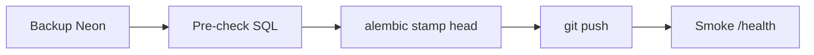

# Antes do push no Render (produção)

Use este guia **antes de cada push** que dispare deploy no Render (`projetorpg-7ih3.onrender.com`), até o item pendente de Alembic estar concluído.

## Pendência atual (2026-07-11)

| Item | Estado |
|------|--------|
| Stamp `alembic_version` → `p1q2r3s4t5u6` no Neon Oregon | 🔴 Pendente |
| Pre-check schema Tormenta + convite | ✅ OK (2026-07-10) |

Ver também: [PENDENTE-STAMP-NEON.md](../PENDENTE-STAMP-NEON.md) na raiz do repo.

---

## Ordem recomendada



1. **Backup** — Neon Console → Backup & Restore  
2. **Pre-check** — `scripts/neon-producao-alembic-precheck.sql`  
3. **Stamp** — `scripts/neon-producao-alinhar-alembic.sh` (**não** `upgrade head`)  
4. **Push** — branch que o Render deploya (ex. `feature/salva`)  
5. **Validar** — login, dashboard Tormenta, abrir ficha com campanha  

---

## Comandos resumidos

```bash
export DATABASE_URL='postgresql://...@ep-xxx-pooler.c-3.us-west-2.aws.neon.tech/neondb?sslmode=require'

psql "$DATABASE_URL" -v ON_ERROR_STOP=1 -f scripts/neon-producao-alembic-precheck.sql
./scripts/neon-producao-alinhar-alembic.sh

cd backend && alembic current
```

---

## O que NÃO fazer

- ❌ `alembic upgrade head` manual neste banco (schema já materializado em `public`)
- ❌ Usar `DATABASE_URL` de Virginia ou de outro projeto Neon
- ❌ Stamp sem backup

---

## Depois do stamp concluído

1. Atualizar ou apagar `PENDENTE-STAMP-NEON.md`
2. Próximos deploys: migrations **novas** usam `upgrade head` normalmente
3. Manter checklist geral em [PRE_DEPLOY_CHECKLIST.md](../PRE_DEPLOY_CHECKLIST.md)
