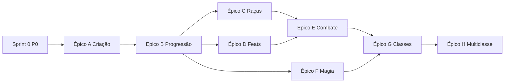

# Backlog D&D 5e — Arena TTRPG

Backlog derivado de `.cursor/requisitos/dnd5e/` cruzado com o código em `backend/app/games/dnd5e/` e `frontend/games/dnd5e/`.

**Legenda de prioridade**

| Prioridade | Significado |
|------------|-------------|
| **P0** | Bloqueia uso correto da ficha / dados inconsistentes |
| **P1** | Fecha lacunas centrais do PHB na criação e progressão |
| **P2** | Combate e magia mais fiéis à mesa |
| **P3** | Polimento, variantes e conteúdo estendido |

**Estimativa:** S (≤1d) · M (2–4d) · L (1–2 sem)

---

## Sprint 0 — Correções imediatas (P0)

| ID | Item | RF | Escopo | Critério de aceite |
|----|------|-----|--------|-------------------|
| D5E-001 | Sincronizar XP ao carregar ficha e bloquear progressão sem save | 03 | FE + BE | ✅ Ao abrir personagem com nível > XP permitido, UI ajusta XP mínimo; HP-roll/marco exigem save se XP divergir do servidor |
| D5E-002 | Legibilidade do campo PV atual | UI | FE | ✅ `#f5e_hp_atual` legível (cor clara, fonte maior, centralizado) |
| D5E-003 | Alinhar doc RF de XP com PHB no código | 03 | Docs | ✅ `03-classes-dnd5e.md` + `TABELA_XP_POR_NIVEL` PHB (nív. 12–20 corrigidos) |

---

## Épico A — Criação de personagem completa (P1)

Referência: `07-equipamento`, `08-antecedentes`, `02-raças`, `06-talentos`.

| ID | Item | Est. | Critério de aceite |
|----|------|------|-------------------|
| D5E-010 | Ouro inicial por classe (rolagem 2d4×10 etc.) | M | ✅ Pré-cadastro/ficha rola ou permite fixar ouro; valor persiste em `ficha_json.inventario.ouro_po` |
| D5E-011 | Aplicar antecedente na criação (`aplicar_antecedente`) | M | ✅ Equipamento + ouro + traços na ficha; perícias já via API; idiomas placeholder (ver D5E-012) |
| D5E-012 | Idiomas do antecedente (select real, não placeholder) | S | ✅ Jogador escolhe N idiomas conforme `idiomas_qtd`; persiste na ficha |
| D5E-013 | Traços de antecedente (`gerar_tracos` + UI) | M | ✅ Sorteio ou pick de personalidade/ideais/laços/fraquezas; exibidos na ficha e salvos em `ficha_json` |
| D5E-014 | Feat humano nível 1 | S | ✅ Se raça = humano, pendência `feat_nivel_1` ou marco antes do save |
| D5E-015 | Equipamento inicial de classe (opcional PHB) | L | ✅ Pacote padrão por classe via `/aplicar-equipamento-classe`; botão na ficha |

**Dependências:** D5E-010 antes de D5E-011 (ouro total = classe + antecedente).

---

## Épico B — Progressão e PV (P1)

Referência: `00-pontos-de-vida`, `03-classes`, `06-talentos`.

| ID | Item | Est. | Critério de aceite |
|----|------|------|-------------------|
| D5E-020 | HP retroativo ao subir CON (ASI/feat) | M | ✅ Ao registrar ASI em CON ou feat +CON, recalcular `hp_max` (+1 por nível por ponto de mod) |
| D5E-021 | Pré-preencher nível pendente no HP-roll | S | ✅ Campo “Rolar PV (nível)” usa primeiro item de `niveis_hp_pendentes` |
| D5E-022 | Repouso longo na ficha (PV + slots) | M | ✅ Botão/ação recupera PV (1d8+CON por nível acima de 1, mín. 1) e chama descanso longo de conjuração |
| D5E-023 | Pendências de progressão na UI | S | ✅ Lista pendências traduzidas; destaque quando XP/nível/HP/marco incompletos |

---

## Épico C — Raças e antecedentes mecânicos (P2)

Referência: `02-raças`, `08-antecedentes`.

| ID | Item | Est. | Critério de aceite |
|----|------|------|-------------------|
| D5E-030 | Traits raciais em combate (primeira leva) | L | ✅ Elfo (vantagem encantamento), anão (resistência veneno), halfling (sorte) na API/arena |
| D5E-031 | Escolhas variantes (draconato, tiefling) | M | ✅ Select de linhagem; resistência no catálogo, preview e combate |
| D5E-032 | Perícia/tool proficiencies de antecedente além de perícias | S | ✅ Ferramentas do antecedente no catálogo e painel da ficha |

---

## Épico D — Feats com efeito real (P2)

Referência: `06-talentos-feitos`.

| ID | Item | Est. | Critério de aceite |
|----|------|------|-------------------|
| D5E-040 | Infraestrutura `aplicar_feat_efeito` | M | ✅ Hook em ficha preview, combate (ataque) e progressão (Tough/Alert) |
| D5E-041 | Feats combate tier 1 | L | ✅ Alert (+5 ini), Observant (passiva), Resilient (save prof), Lucky (contador arena) |
| D5E-042 | Feats magia tier 1 | M | ✅ War Caster (vantagem concentração), Magic Initiate (resumo ficha + `feat_escolhas`) |
| D5E-043 | Feats já parciais | S | Tough e ASI — revisar regressão; documentar no README do módulo |
| D5E-044 | Talento Habilidoso (Skilled) — 3 proficiências | S | ✅ `feat_escolhas.skilled_pericias`; RF `10-pericias-dnd5e.md` |
| D5E-045 | Override manual de proficiências | S | ✅ `pericias_override` + UI Editar; mesa/multiclasse parcial |
| D5E-046 | Expertise (Ladino/Bardo) | M | ✅ `expertise_pericias` + API/UI |
| D5E-047 | Talento Especialista (Skill Expert) | S | ✅ `feat_escolhas.skill_expert_*` |

---

## Épico E — Combate / arena (P2)

Referência: `04-combate`.

| ID | Item | Est. | Critério de aceite |
|----|------|------|-------------------|
| D5E-050 | Propriedades de arma no ataque | L | ✅ Finesse, versátil, leve, duas mãos via `arma_combate` + API `/ataque` e `/dano` |
| D5E-051 | Ações de combate PHB | M | ✅ Dash, Dodge, Disengage, Help na UI e economia de turno |
| D5E-052 | Ataque de oportunidade (básico) | M | ✅ Sair do alcance dispara reação (respeita Desengajar) |
| D5E-053 | Dano massivo = morte instantânea | S | Se dano ≥ hp_max em um golpe, regra aplicada na API de dano |
| D5E-054 | Modificadores situacionais | M | Prone, acuado (+2 ca corpo-a-corpo), atacante cego/invisível |

---

## Épico F — Magia (P2)

Referência: `05-magia`, `09-regra-lista-magias`.

| ID | Item | Est. | Critério de aceite |
|----|------|------|-------------------|
| D5E-060 | Falha por armadura sem proficiência | S | ✅ Conjuração bloqueada na arena se armadura/escudo sem proficiência de classe |
| D5E-061 | Regra ação bônus + truque | S | Após magia como ação bônus, só truque na ação padrão no mesmo turno |
| D5E-062 | Componentes V/S/M e materiais consumíveis | M | Validação silêncio/mãos; decremento de item consumível no inventário |
| D5E-063 | Monge — Ki e magias monásticas | L | Pontos Ki, tabela por nível, descanso curto |
| D5E-064 | Ritual e upcasting — cobertura de testes | M | Casos de teste para 5 magias representativas (truque, 1, 2, 3, ritual) |

---

## Épico G — Classes e subclasses (P3)

Referência: `03-classes`.

| ID | Item | Est. | Critério de aceite |
|----|------|------|-------------------|
| D5E-070 | Catálogo `features` por classe/nível | L | JSON enxuto nível 1–5 por classe; exibição na ficha |
| D5E-071 | Extra Attack nível 5 | M | Guerreiro/paladino/ranger/barbaro/monge: 2º ataque na arena |
| D5E-072 | Subclasse — 1 feature por arquétipo (MVP) | L | Uma habilidade mecânica por subclasse escolhida (ex.: Colégio do Conhecimento) |

---

## Épico H — Multiclasse (P3)

Referência: `06-talentos` (seção Multiclasse).

| ID | Item | Est. | Critério de aceite |
|----|------|------|-------------------|
| D5E-080 | Modelo de dados multiclasse | L | `ficha_json.classes: [{slug, nivel}]`; migração compatível |
| D5E-081 | Validar requisitos (13+ atributos) | M | `validar_multiclasse` integrado ao save |
| D5E-082 | Slots e proficiências multiclasse | L | Tabela de conjuração combinada PHB |

---

## Épico I — Qualidade e catálogo (contínuo)

| ID | Item | Est. | Critério de aceite |
|----|------|------|-------------------|
| D5E-090 | Atualizar `backend/app/games/dnd5e/README.md` | S | Reflete personagens, grimório, arena implementados |
| D5E-091 | CI: suíte `test_dnd5e_*` no pipeline | S | Job dedicado ou filtro estável no CI |
| D5E-092 | Sincronizar catálogo com 5e-database v5.7.0 | M | Script documentado; diff revisável por domínio |
| D5E-093 | Tradução PT magias — cobertura mínima 95% | M | Métrica no seed/sync |

---

## Ordem sugerida de implementação

### Próximos itens (pós D5E-041…052)

1. **D5E-043** — Revisão Tough/ASI e regressão de feats parciais
2. **D5E-053+** — Demais ações/reações PHB (Ready, Hide, etc.)
3. **D5E-053+** — Demais ações/reações PHB (Ready, Hide, etc.)

---

## Definição de pronto (DoD)

- Código em `games/dnd5e/` apenas (nunca misturar `dnd35`)
- Schema Pydantic + rota com teste em `backend/tests/test_dnd5e_*.py`
- UI consome API existente; strings PT-BR na interface
- RF correspondente referenciado no PR/commit
- Sem texto longo de livro no repositório

---

## Referências

- Requisitos: `.cursor/requisitos/dnd5e/`
- Plano UI: `docs/dnd5e/plano-ui-dashboard.md`
- ADR dados: `docs/adr/0003-dnd5e-fonte-dados-5e-database.md`
- Gate: `AGENTS.md`, `.cursor/rules/requisitos-implementacao.mdc`
