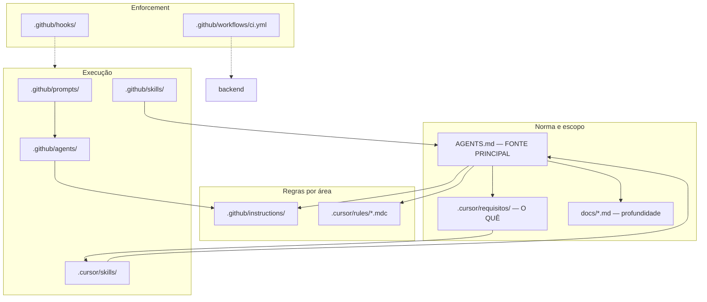
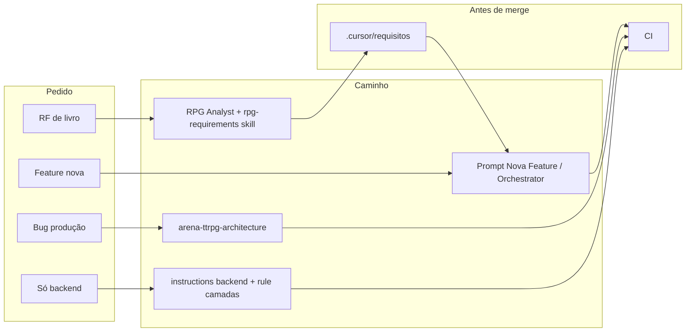

# Governança de agentes e fluxos — Arena TTRPG

> Guia pessoal e de equipa: como `AGENTS.md`, requisitos, rules, skills, agentes, prompts e hooks se ligam.  
> **Planilha de consulta rápida:** [governanca-agentes-fluxos.xlsx](./governanca-agentes-fluxos.xlsx)  
> **Documento relacionado (foco Copilot):** [GUIA_ORQUESTRACAO_AGENTES.md](../GUIA_ORQUESTRACAO_AGENTES.md)  
> **Fonte normativa (sempre prevalece):** [AGENTS.md](../AGENTS.md)

---

## 1. Ideia central



**Regra de ouro:** em conflito, **`AGENTS.md` vence**. Ficheiros em `.cursor/requisitos/` definem **o quê** implementar; não substituem arquitetura, deploy nem multi-jogo.

---

## 2. Pirâmide de documentos

| Nível | O quê | Caminho | Função |
|-------|--------|---------|--------|
| 1 | Governança geral | [AGENTS.md](../AGENTS.md) | Idioma, camadas, multi-jogo, deploy, agentes, prompts |
| 2a | Arquitetura (detalhe) | [docs/arquitetura-camadas-solid.md](./arquitetura-camadas-solid.md), [docs/arquitetura-multi-jogo.md](./arquitetura-multi-jogo.md), [docs/ports-repositorios-servicos.md](./ports-repositorios-servicos.md) | SOLID, Auth Hub, ports |
| 2b | Requisitos funcionais | [.cursor/requisitos/](../.cursor/requisitos/) | RF por jogo (`dnd35`, `dnd5e`, `tormenta`, `gurps`) |
| 2c | Instruções por domínio | [.github/instructions/](../.github/instructions/) | Backend, frontend, migrations |
| 3 | Regras Cursor | [.cursor/rules/](../.cursor/rules/) | Resumo + gate por glob |
| 4 | Skills | [.cursor/skills/](../.cursor/skills/), [.github/skills/](../.github/skills/) | Playbooks sob demanda |
| 5 | Agentes e prompts | [.github/agents/](../.github/agents/), [.github/prompts/](../.github/prompts/) | Personas e atalhos (principalmente Copilot) |
| 6 | Hook | [.github/hooks/](../.github/hooks/) | Guarda terminal/SQL destrutivo |
| 7 | CI | [.github/workflows/ci.yml](../.github/workflows/ci.yml) | Lint e testes no push/PR |
| — | Tracking manual | [MELHORIAS.md](../MELHORIAS.md), [HISTORICO_EVOLUCAO.md](../HISTORICO_EVOLUCAO.md) | Débito e histórico (**não ligados automaticamente**) |

---

## 3. Arquitetura vs funcionalidade vs qualidade

| Tipo | Onde | Exemplo |
|------|------|---------|
| Arquitetura (como codar) | `AGENTS.md`, `docs/arquitetura-camadas-solid.md`, `.cursor/rules/arquitetura-camadas.mdc` | API → service → repository; `app.games.<slug>` |
| Funcional (o quê) | `.cursor/requisitos/<jogo>/` | Magia, combate, familiar |
| Convenções de jogo | `.cursor/skills/*` | Conjuração D&D 3.5, Tormenta MB |
| Qualidade / CI | `docs/normas-qualidade-backend-ci.md`, `.cursor/rules/backend-qualidade-ci.mdc` | `make ci-backend-lint` |
| Deploy / produção | `AGENTS.md` § Infra, skills `arena-ttrpg-architecture`, `arena-producao-dados-neon-render` | Vercel, Render, Neon |
| SDD leve | [docs/fluxo-spec-driven-leve.md](./fluxo-spec-driven-leve.md) | Rota = schema + teste; frontend `?v=` |

---

## 4. Entrada por ferramenta

| Ferramenta | O que carrega automaticamente | O que tens de pedir |
|------------|------------------------------|---------------------|
| **Cursor** | Rules por glob; skills listadas; `AGENTS.md` como regra solicitável | `@` ficheiros, RF, skills; modo Agent para implementar |
| **GitHub Copilot** | `.github/copilot-instructions.md` → `AGENTS.md`; instructions por `applyTo` | Agent picker; prompts `/Nome Do Prompt` |
| **Humano** | CI no GitHub | Ler gate em `.cursor/requisitos/README.md` antes de codar |

---

## 5. Agentes (`.github/agents/`)

| Agente | Ficheiro | Quando usar | Delega para |
|--------|----------|-------------|-------------|
| Fullstack Orchestrator | `fullstack-orchestrator.agent.md` | Feature/bug multi-camada | Backend, Frontend, DB/Migrations, PostgreSQL DBA, JS Auditor |
| Fullstack API Contract Orchestrator | `fullstack-api-contract-orchestrator.agent.md` | Payload, validação, compatibilidade API | Backend, Frontend, DB/Migrations |
| Backend FastAPI Specialist | `backend-fastapi-specialist.agent.md` | API, services, auth, testes Python | — |
| Frontend Arena Specialist | `frontend-arena-specialist.agent.md` | HTML/CSS/JS, `getApiUrl`, `?v=` | — |
| Database and Migrations Specialist | `database-and-migrations-specialist.agent.md` | Alembic, models, seeds | — |
| PostgreSQL Database Administrator | `postgresql-database-administrator.agent.md` | Estado real do Postgres em execução | — |
| JavaScript Project Auditor | `javascript-project-auditor.agent.md` | Auditoria ampla de JS | — |
| RPG Requirements Analyst | `rpg-requirements-analyst.agent.md` | Livro/PDF → RF | Explore*, PDF Explore, Backend, Frontend, DB, orchestrators |
| PDF Explore Specialist | `pdf-explore-specialist.agent.md` | Extrair PDF/OCR | — |

\* **Explore** é subagente do runtime Copilot, não um ficheiro em `.github/agents/`.

**Subagente:** agente A invoca agente B (lista `agents:` no frontmatter). No **Cursor**, existem ainda subagentes do editor (`explore`, `shell`, `generalPurpose` via Task) — **não** estão no repositório.

---

## 6. Prompts (`.github/prompts/`)

| Prompt | Agente | Invocação Copilot |
|--------|--------|-------------------|
| Nova Feature Fullstack | Fullstack Orchestrator | `/Nova Feature Fullstack` |
| Correção Bug Fullstack | Fullstack Orchestrator | `/Correcao Bug Fullstack` |
| Refatoração Segura por Domínio | Fullstack Orchestrator | `/Refatoracao Segura por Dominio` |
| Auditoria Pré-Merge Fullstack | Fullstack Orchestrator | `/Auditoria Pre-Merge Fullstack` |
| Migration Segura | API Contract Orchestrator | `/Migration Segura` |
| Deploy Readiness Fullstack | Fullstack Orchestrator | `/Deploy Readiness Fullstack` |
| Investigação Performance Fullstack | Fullstack Orchestrator | `/Investigacao Performance Fullstack` |
| Levantamento Requisitos RPG | RPG Requirements Analyst | `/Levantamento Requisitos RPG` |

**No Cursor:** colar o conteúdo do `.prompt.md`, ou `@.github/prompts/nova-feature-fullstack.prompt.md` + pedido.

---

## 7. Rules Cursor (`.cursor/rules/`)

| Ficheiro | Glob | Conteúdo |
|----------|------|----------|
| `arquitetura-camadas.mdc` | `backend/**/*` | Camadas + multi-jogo → `AGENTS.md` |
| `requisitos-implementacao.mdc` | `.cursor/requisitos/**/*` | Gate antes de implementar RF |
| `backend-qualidade-ci.mdc` | `backend/**/*.py` | `make ci-backend-lint` |

Todas: `alwaysApply: false` — ativam por glob ou `@` explícito.

---

## 8. Skills

| Pasta | Índice | Uso |
|-------|--------|-----|
| `.cursor/skills/` | [README](../.cursor/skills/README.md) | Deploy, D&D 3.5, Tormenta, GURPS, produção |
| `.github/skills/` | [README](../.github/skills/README.md) | RF a partir de PDF, auditoria JS, design |
| `~/.cursor/skills-cursor/` | (fora do repo) | Ferramentas globais do Cursor |

**Regra:** 1–2 skills por conversa. Ver atalho em [.cursor/skills/README.md](../.cursor/skills/README.md).

---

## 9. Hooks

| Item | Caminho |
|------|---------|
| Config | `.github/hooks/operational-safety.json` |
| Script | `.github/hooks/scripts/pre_tool_use_guard.py` |
| Evento | `PreToolUse` — antes de comandos de terminal |

Pede confirmação para: `git reset --hard`, `rm -rf`, `DROP DATABASE`, etc.

**Nota:** o JSON pode ter `cwd` com caminho absoluto da máquina — atualizar ao clonar noutro PC.

---

## 10. Itens com ligação fraca ou “soltos”

| Item | Situação |
|------|----------|
| `GUIA_ORQUESTRACAO_AGENTES.md` | Espelha este guia; pode desatualizar se só um for editado |
| `.github/agents/` + prompts | Desenhados para Copilot; no Cursor = referência textual |
| Skill `postgresql` em `.github/skills/` | Migração **.NET**, não Neon do Arena |
| `MELHORIAS.md` | Lista manual; agente não lê sozinho |
| `livros/`, `helpers/` | Local, `.gitignore` |
| RF `dnd5e` vs código | Pode estar à frente ou atrás de `dnd35` em produção |

---

## 11. Como usar no Cursor (dia a dia)

### Fluxo genérico

1. Citar ou confiar em **AGENTS.md** (e rules por glob).
2. Feature de jogo → **`@.cursor/requisitos/<jogo>/...`**
3. Backend → rule `arquitetura-camadas`; opcional `@.github/instructions/backend.instructions.md`
4. **1 skill** do índice `.cursor/skills/README.md`
5. Modo **Agent** para implementar; **Ask** para só perguntar
6. Antes do PR: `make ci-backend-lint`

### Exemplos de mensagem

```text
Implementa o RF em @.cursor/requisitos/dnd35/10-familiar-dnd35.md
Segue AGENTS.md (camadas; só games/dnd35).
```

```text
Erro CORS em produção: @.cursor/skills/arena-ttrpg-architecture/SKILL.md
e AGENTS.md (infra).
```

```text
Analisa capítulo X e gera RF em .cursor/requisitos/dnd35/
@.github/skills/rpg-requirements-analysis/SKILL.md — não codar ainda.
```

---

## 12. Como usar no GitHub Copilot

1. Copilot lê `.github/copilot-instructions.md` → **AGENTS.md**
2. Escolher agente no picker ou prompt `/Nome`
3. Orquestrador delega conforme `agents:` no `.agent.md`

---

## 13. Fluxos por tipo de trabalho



### Receitas rápidas

| Tarefa | Ordem |
|--------|--------|
| Nova mecânica D&D 3.5 | AGENTS → rpg-requirements (+ pdf se livro) → escrever RF → implementar com RF + skill de domínio |
| Bug ficha D&D 3.5 | RF específico → skill se magia/progressão → `games/dnd35/` |
| Erro só em produção | arena-ttrpg-architecture → arena-producao-dados se BD |
| Migration | Prompt Migration Segura / API Contract Orchestrator → PRE_DEPLOY + skill Neon |

---

## 14. Manutenção deste guia

1. Alterar normas em **AGENTS.md** primeiro.
2. Atualizar **`.github/instructions/`** se regra de código mudar.
3. Atualizar **`.cursor/rules/`** se quiseres resumo automático por glob.
4. Novo jogo → `.cursor/requisitos/<slug>/` + skill em `.cursor/skills/`.
5. Regenerar planilha após mudanças grandes: `python3 scripts/generate-governanca-xlsx.py`
6. Não duplicar parágrafos longos em `copilot-instructions.md`.

---

## 15. Referências

- [AGENTS.md](../AGENTS.md)
- [.cursor/requisitos/README.md](../.cursor/requisitos/README.md)
- [.cursor/skills/README.md](../.cursor/skills/README.md)
- [GUIA_ORQUESTRACAO_AGENTES.md](../GUIA_ORQUESTRACAO_AGENTES.md)
- [governanca-agentes-fluxos.xlsx](./governanca-agentes-fluxos.xlsx)
